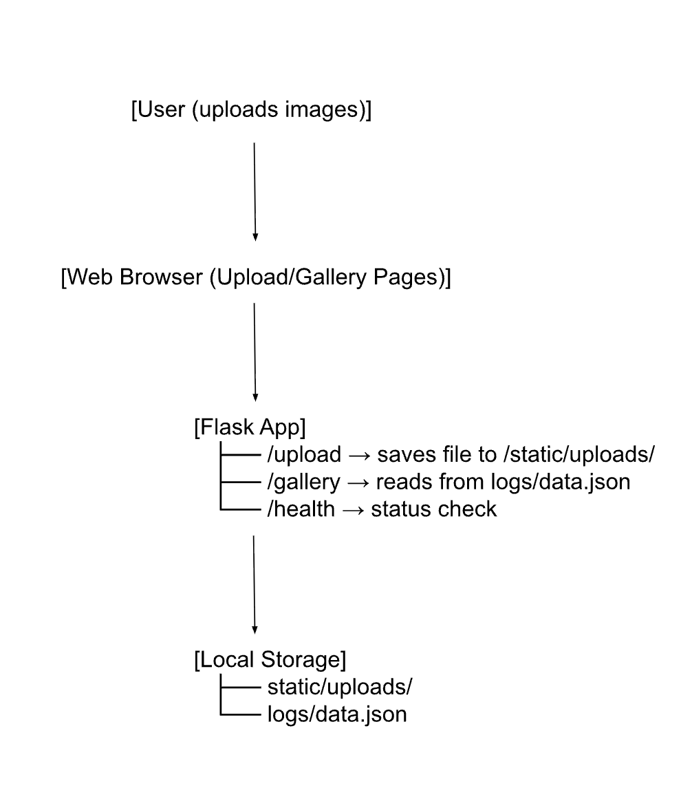

# Case–Study Final Project Write–Up: Wildlife Image Logger

## 1. Executive Summary
Problem: Wildlife researchers and environmental scientists often have trouble keeping track of wildlife and animal sighting over time efficiently.

Solution: The Wildlife Image Logger is a web app built with Flask that lets users upload wildlife photos, tag them by species and location, and view them in a searchable gallery. Uploaded images are stored locally on the server (inside static/uploads/), and each upload is logged in logs/data.json. The gallery automatically displays new images as they’re added. This makes it easy way to organize wildlife sightings, track observations over time, and review submissions without needing complex tools.

## 2. System Overview
- **Course Concepts**: 
  - Flask API: Used to build the upload form, gallery page, and health endpoint
  - Flask Routing & File Uploads: Receives the uploaded image, verifies the extension, stores the file, and responds with JSON
  - Structured Logging (JSON): Every upload is logged to /logs/data.json with timestamp, species, location, and filename
  - Docker Containerization: Creates a stable, repeatable environment so the app runs anywhere with one command
- **Architecture Diagram**: 
  - 
- **Data/Models/Services**: 
  - Uploads: User uploaded images stored under `/static/uploads/`
  - Logs: Stored in `/logs/data.json`
  - File naming: Automatically includes species, location, and timestamp (for organization)
  - Formats: Accepts common image types (.png, .jpg, .jpeg)

## 3. How to Run (Docker) 
#### a. Build the image
docker build -t ecotrack:latest .
#### b. Run the container
docker run --rm -p 5001:5000 \
  -v $(pwd)/logs:/app/logs \
  -v $(pwd)/static/uploads:/app/static/uploads \
  ecotrack:latest

(Mounts local folders so uploaded files and logs are saved persistently.)
#### c. Then open your web browser and go to:
http://localhost:5001
#### d. Health check
curl http://localhost:5001/health

## 4. Design Decisions
**Why this concept?**

I decided to make a Wildlife Image Logger because I wanted to practice Flask routing, file uploads, and Docker deployment, which were topics that we learned in class. It’s a straightforward and simple idea, but it feels realistic to build because it demonstrates how user images can move through a full web app. 

**Alternatives considered:**

I could have made a command-line app to upload files, but using Flask shows more clearly how a web app handles users and files.

**Tradeoffs:**

Using Docker makes setup a little more complicated, but it lets the app run anywhere. I chose JSON logs to save upload data instead of a database because it’s simpler and easier to work with, even though that means the app wouldn’t handle a huge number of users as easily.

**Security/Privacy:** 

Input validation ensures only image files are uploaded. No sensitive user data (PII) is collected. Secrets management was not required for this project. Secrets aren’t kept in the code since putting credentials in a public repo isn’t safe. Instead, any cloud credentials go in a local .env file that isn’t pushed to GitHub. If Azure were used, the images would go into a private blob container so they’re not accessible to the public.

**Ops:** 

Running the app in Docker keeps all the dependencies separated from the system and makes resource usage more consistent. Uploaded data is logged in /logs/data.json so I can track uploads. The app isn’t built for heavy traffic, but it works smoothly in a single Docker container.

## 5. Results & Evaluation
**Gallery Example**

**Sample Output (from Upload)**

{

  "ok": true,
  "message": "Upload successful!",
  "file": "EcoTrack_Flamingos_South_America_20251110T202005_flamingos.jpeg"

}

**Performance Notes**
- App starts instantly in Docker.
- Memory footprint <50MB.
- Uploads save in less than a second.
- Gallery loads quickly. 

**Validation Testing**
- Verified /upload, /gallery, and /health endpoints using curl.
- Confirmed that uploaded images appear in /static/uploads/ and show correctly in the gallery.
- Validated the app by testing both valid and invalid uploads (wrong file types, missing files) and confirmed that the API returned the correct error responses.

**Tested endpoints with curl commands:**
#### Upload a test image
curl -X POST -F "file=@assets/test-image.png" http://localhost:5001/api/v1/upload

#### Output:

{

  "file": "test-image.png",

  "message": "Upload successful!",

  "ok": true,

  "url": "/static/uploads/EcoTrack_unknown_unspecified_20251111T012352_test-image.png"

}

#### Fetch gallery
curl http://localhost:5001/api/v1/gallery

#### Output:

{

  "gallery": [

    "/static/uploads/EcoTrack_unknown_unspecified_20251111T012352_test-image.png"

  ],

  "ok": true

}

## 6. What’s Next
- Show a preview of the image on the upload page so users can see it before they submit.
- Add more search/filter options on the gallery page (like by date or species).
- Add login so only certain people can upload images.
- Add simple logs or a dashboard to monitor uploads and activity.

## 7. Links (Required)
GitHub Repo: https://github.com/clairicelou/DS2022project 

Public Cloud App (optional): <INSERT-CLOUD-URL>

